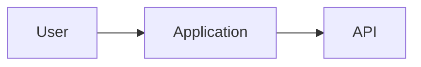

# Architecture

## Overview
[Describe the high-level architecture]

## Main components
- [Component 1]
- [Component 2]

## Module structure
- [Module 1]
- [Module 2]

## Feature Documentation
- Feature index: [`docs/features/INDEX.md`](features/INDEX.md)
- Glossary: [`docs/GLOSSARY.md`](GLOSSARY.md)
- NFR: [`docs/nfr/NON_FUNCTIONAL.md`](nfr/NON_FUNCTIONAL.md)

## Diagrams

## Main flow
1. [Step 1]
2. [Step 2]

## Scaling decisions
- [Decision 1]
- [Decision 2]
